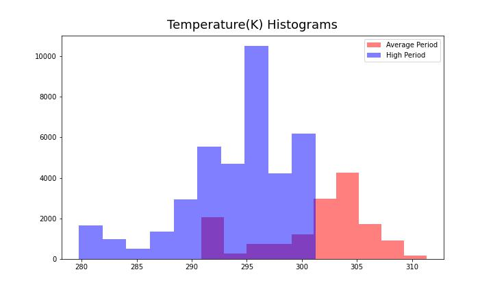
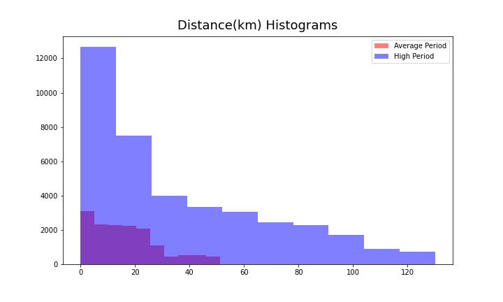
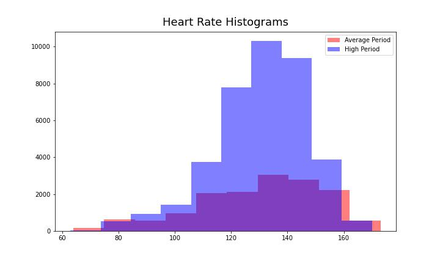
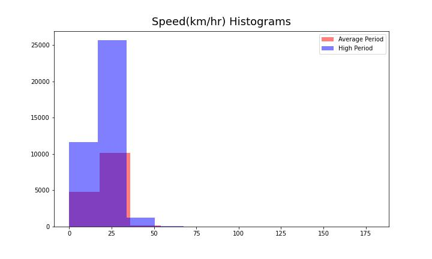
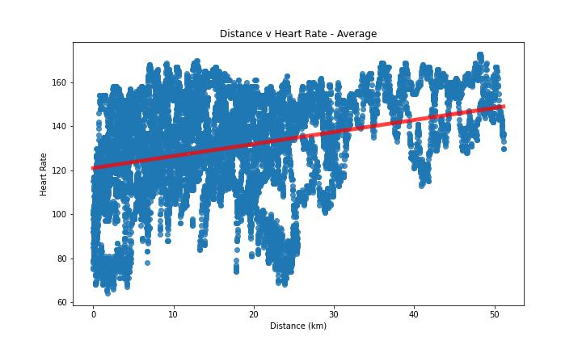
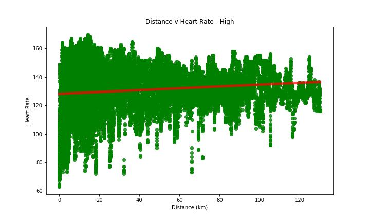
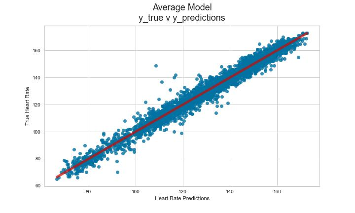
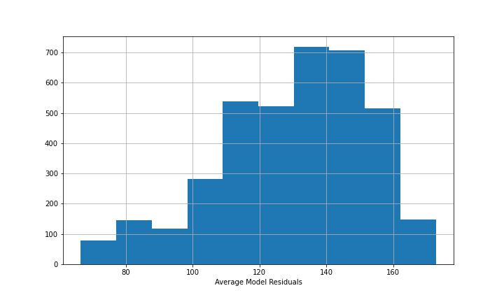
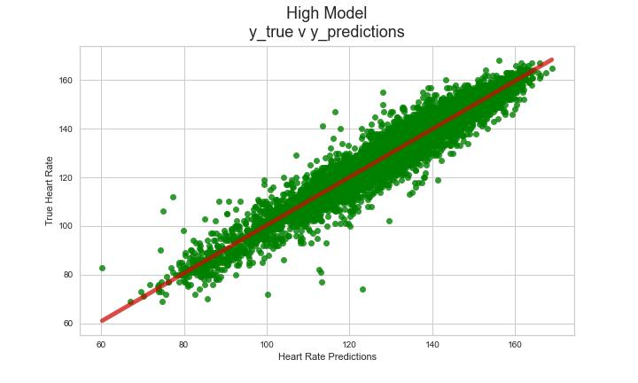
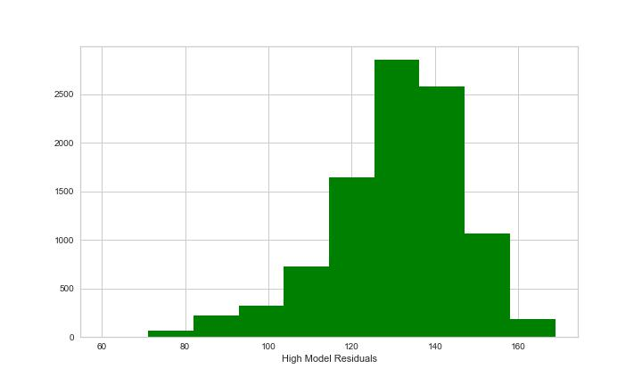

# Predicting Cycling Metrics by Adriana J. Machado
---

# Table of Contents
---
#### [Background and Problem Statement ](#Background-&-Problem-Statement)
#### [Data Gathering, Extracting, and Combining ](#Data-Gathering,-Extracting,-&-Combining)
#### [Exploratory Data Analysis](#Train-Dataset-Exploratory-Data-Analysis)
#### [Modeling ](#Modeling)
#### [Predictions & Dashboards (Tableau & Streamlit)](#Predictions,-Tableau,-&-Streamlit)
#### [Conclusions & Recommendations ](#Conclusion-and-Recommendations)
#### [Data Descriptions ](#Data-Descriptions)

# Background & Problem Statement
---
[Back to ToC](#Table-of-Contents)

Humans have been bicycling for hundreds of years. The earliest verified bicycle was the German draisine, or velocipede, dating back to 1817 and invented by Baron Karl von Drais. The name "bicycle" was coined in 1860s France. Earlier unverified and debatable accounts go as far as 1500 AD to a sketch by Gian Giacomo Caprotti, a pupil of Leonardo da Vinci ([source](https://en.wikipedia.org/wiki/History_of_the_bicycle)).

The estimated size of the US bicycle market from 2004-2005 was $6.2bn USD. There were an estimated 52.73m cyclists aged 6+ in 2020. And the growing e-bike market is projected to be $53.53bn USD by 2027 ([source](https://www.statista.com/topics/1686/cycling/#topicHeader__wrapper)).

Whether you are cycling for enjoyment, sport, or as a commuter, predicting the uncertainty of a route can be useful. How much exertion is it going to take riding to work? Is the headwind going to suck? Am I in shape enough to take that route on my bicycle or should I invest in an e-bike? 

Earlier this year, in the late Winter and Spring, I was training to complete my first century for later in August, the Marin Century Classic in Marin County, California. I had been cycling around 100+ miles (161+ km) a week on road and gravel trails with varying elevation changes. I had a training coach app and was cycling far above average. According to my Garmin watch stats, I had been in the 95th percentiles for distance and time spent cycling out of all female Garmin users. 

In May I started the full-time Data Science Immersive with General Assembly and the time I spent training had to be compromised with the time I would invest in my professional development. Giving up on a goal did not feel great but I knew it was necessary and only a set back that I could return to. I kept up cycling as regular exercise completing < 30 miles (<48 km) per week. However, I still was curious about how I would have done in the Marin Century at my peak (high) training period compared to if I had participated in my current average performance period. 

Heart rate, heart rate zones (intensity), and power output are good measures of how much a cyclist is exerting. Weather can also make a huge impact on the difficulty of a route, outside of the expected elevation changes. Using the resources I had, I decided to predict heart rate, which would be translated into intensity zones based on previous activity data (trackpoints) from Garmin .gpx files and weather data from each trackpoint. Here's some more on intensity zones and how they inform about stress on your body ([source](https://www.garmin.com/en-US/blog/general/get-zone-train-using-heart-rate/)).

**Cycling is a widely popular sport and can accommodate a range of experiences. Being able to predict how much stress a route may put on your body can be really useful and offer a lot of insight for goal-making or reality-checking. Given past periods of cycling performance, how will I perform on a given route, based on heart rate intensity zones? Is that trail going to be too difficult or am I capable of riding it without feeling like I'm going to die?**

# Data Gathering, Extracting, & Combining
---
[Back to ToC](#Table-of-Contents)
## Sources & Functions
- Garmin GPX cycling activitiy files (April 2022 & July 2022)
    - Consists of data trackpoints gathered every few seconds of an activity
    - Timestamp, latitude, longitude, elevation, heart rate, and cadence (cadence was left out due to lack of data in all activities)
- [OpenWeather One Call 3.0 API](https://openweathermap.org/api/one-call-3) weather data per trackpoint
    - Startup subscription plan
    - Temperature (K), feels like (temp), pressure (hPa), humidity (%), dew point (K), clouds (boolean), wind speed (meters/sec), wind degree (meteorological) per trackpoint
- GPX file from the Marin Century Classic route
    - Latitude, longitude, and elevation for each trackpoint
- [Strava API](https://developers.strava.com/docs/reference/) was initially explored but obstacles were met when trying to extract trackpoint data, summary data per activity ended up being the most accessible but wasn't impactful for this project. The code is available to explore, if curious. 
- A few functions were created to extract from the GPX files as well as connecting to the APIs. See code for details. 

I wanted to be able to build a model based on trackpoint data rather than an average per activity. Throughout the duration of a ride, biometric data and weather data can vary as the day goes on and as elevation and terrain changes along the route. Garmin's GPX files proved to be the most reliable and available. 

OpenWeather's API was not totally clear in the documentation, but you are able to use UNIX timestamps to pull exact weather for a timestamp (historical, present, and forecasted). This took some playing with and a lot of trial and error but eventually I was able to get super exact weather for the train and test set. 

## Train Datasets - Average & High
I built two datasets to train two models on in order to compare how I might perform in relatively average cycling shape and relatively high cycling shape. The average set used data from July 2022 and the high set used data from April 2022. 

After extracting activity and biometric datafrom the GPX files, I feature engineered variables relating to distance, time, and elevation. I then went trackpoint by trackpoint with the weather function and added the weather data. The two datasets were then saved and used later for the two models. 

## Test Dataset
A GPX file was available from the Marin Century organizers. These files are most commonly used when uploading routes to your preferred route tracking devices or apps. The file only had latitude, longitude, and elevation per trackpoint. I added a timestamp for the start of the Marin Century (August, 06, 2022 @ 7AM PDT) and calculated the other distance, time, and elevation variables, per trackpoint, from there. Then I went trackpoint by trackpoint into the API to gather all the relevant weather data using the weather function. 

# Train Dataset Exploratory Data Analysis
---
[Back to ToC](#Table-of-Contents)
## Descriptive Statistics Comparisons
- Mean
    - The means for the period of average cycling performance and high cycling performance had some interesting contrasts. Overall many of the differences made sense given high performance cycling period was during the Spring month of April, consisted of a lot longer rides (75+ miles per week), and in varying terrains. Average performance consisted of shorter rides (< 30 miles per week), in the Summer month of July, and usually on the same local routes.

- Standard Deviations
    - Standard Deviations also had some interesting contrasts which made sense based on seasonal weather, distances, and terrains of the types of cycling activities done in July (average performance time period) compared to April (high performance time period).

- Maximums really highlight the difference in performance periods.
    - Max distance during high cycling was a 130km/80mile ride, my longest ride this year.
    - Max heart rate and speed for average period is higher than high performance period which makes sense since some shorter routes have been HIIT workouts, with sprinting, and have also been in higher heat which adds an extra cardio component.
    - Clearly can see the seasonal differences in the temperature differences. 311K (100F, 37.85C) in July during average period and 301K(82F, 27.85C) for April during the high period.
    - Max windspeed during the high period was cross checked and from an organized metric century ride through the Bay Area. If I recall correctly some of those winds almost knocked me over.

- Minimums
    - Nothing too notable, same conclusions about weather seasons, but interesting how I went below sea level (in meters) on some routes, mostly from valley routes, and my minimum for elevation change during high performance had a pretty stark net decline. Cross checking on Strava and that was from a gravel bike ride around the American River, in the Sierra Mountains foothills, which was a super fun ride where I basically went from the top of a mountain down to a river in a canyon and back. 

## Curious Findings

Weather variables, like temperature and wind speed had some stark differences between the average and high datasets. This made sense since average was taken from summer and high was taken from the spring. 

Of course, distance also had a pretty big difference. Making sense since my perceived performance metric was based on how far I was able to ride without getting tired. In April I was doing much longer rides, much more consistently. 

Heart rate and calculated speed were actually very similar between the two periods. 

Speed made sense since I can only go so fast with the type of bike I have and speed is dependent on a lot of other variables.

 

When comparing distance with heart rate during the two periods. I could see how shorter distances had more variability in heart rate during the average period. Heart rate hit higher levels at shorter distances. During the high period, there was more of a constant heart rate maintained at a higher intensity. This indicated higher performance to me since I was able to maintain higher intensities for longer distances. 

## Headwind Exploration

I created a headwind variable using similar calculations used for aircrafts ([source](https://mediawiki.ivao.aero/index.php?title=Crosswind_and_Headwind_calculation)).

While cycling, headwind can feel like a really powerful force, depending on the speed of the wind. This variable needs to be flushed out more to include windforce which would require more data but I added in a simple boolean to account for if a headwind was present. Only 16.33% of trackpoints for both datasets combined experienced headwind but this engineered feature would be used in the final prediction dashboards also. 

# Modeling
---
[Back to ToC](#Table-of-Contents)

A variety of regressor models were tested for both average and high training sets. 
- Linear Regression
- Regressor Boosting
    - AdaBoost with Linear Regression Base Estimator
    - AdaBoost with Decision Tree Base Estimator
    - AdaBoost with Random Forest Base Estimator
    - Gradient Boosting
    - XGBoost
- Neural Net Regressor

## Average Model
The winning model for the average training data was XGBoost. Neural Net came close but XGBoost, FTW. 
- GridSearch Parameters
    - Best Score: 0.9659966627636546
    - learning_rate: 0.8
    - max_depth: 4
    - n_estimators: 150
- Scores & Error Metrics
    - Train R2 Score: 0.9888381686104007
    - Test R2 Score: 0.9719382323708556
    - Mean Absolute Error: 2.7619688805285496
    - Mean Squared Error: 14.165069746789941

## High Model
The winning model for the high training data was also XGBoost but with PolynomialFeatures (as opposed to StandardScaler, alone).
- GridSearch Parameters
    - Best Score: 0.9066727023063461
    - learning_rate: 0.8
    - max_depth: 5
    - n_estimators: 150
    - reg_lambda: 1
- Scores & Error Metrics
    - Train R2 Score: 0.972496927983201
    - Test R2 Score: 0.9227343527337118
    - Mean Absolute Error: 3.2724629223284945
    - Mean Squared Error: 20.24240723309317

# Predictions, Tableau, & Streamlit
---
[Back to ToC](#Table-of-Contents)

## Tableau Dashboards

- Predictions on the Marin Century Classic (August 06, 2022) can be viewed [here](https://public.tableau.com/app/profile/adriana.machado7103/viz/PredictingCyclingMetrics-HeartRateIntensity/IntensityDash)

- Average model dashboard for weather variables and elevation changes can be viewed [here](https://public.tableau.com/app/profile/adriana.machado7103/viz/PredictingCyclingMetrics-AverageModel-WeatherElevation/WeatherElevation-AverageModel)

- High model dashboard for weather variables and elevation changes can be viewed [here](https://public.tableau.com/app/profile/adriana.machado7103/viz/PredictingCyclingMetrics-HighModel-WeatherElevation/WeatherElevationDash-HighModel)

## Streamlit

- LINK COMING SOON